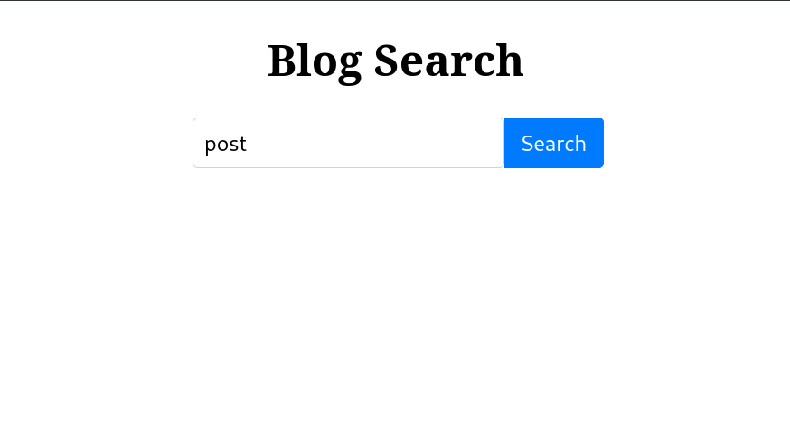
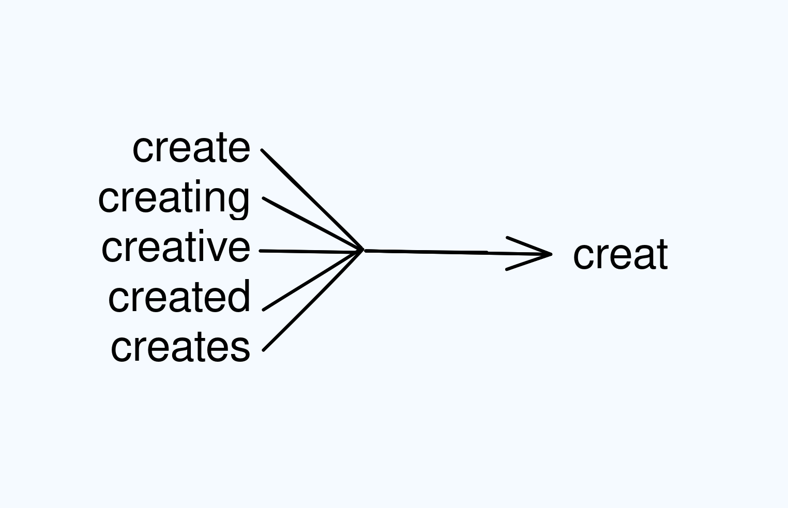

---

In today's blog post, we're going to explore how you can enhance the search functionality of your Django application by integrating Django Watson.

## Why Use Django Watson?

When you use Django Watson, it's like giving your Django app a smart search upgrade. This brings several advantages that make your app even better:

1. **Improved Search Experience**: Django Watson makes searching easier and better for your users. It helps them find what they want more quickly.
2. **Works with Different Databases** : One cool thing about Django Watson is that it can work with different types of databases. So, whether your app uses PostgreSQL, MySQL, or SQLite, this tool can fit right in. You're not stuck with just one type of database.
3. **Clever Searching**: Django Watson is clever under the hood. It uses the full-text search abilities of databases like MySQL and PostgreSQL. For other databases, it uses something called regex-based search. This means it's good at finding things quickly.
4. **Automatic Index Updates**: With Django Watson, you don't have to worry about updating the search index. It does this all by itself. When you add, change, or remove stuff from your app, the search results stay up-to-date. So, your users always see the latest and most accurate results.
5. **Better Results**: Django Watson doesn't just show any results. It ranks them by how relevant they are to what the user wants. This makes it easier for users to find what they're looking for.
6. **Smarter Matching**: This tool allows users to search with incomplete words. For instance, if they type "sess," it still finds things related to "session." Also, Django Watson knows different word forms, so it's like having a really smart search assistant. It understands various word versions, which is great for users.

## Setting up our project

### Prerequisites

We will be installing the following packages:

- Django
- [django-watson](https://github.com/etianen/django-watson)
- django-taggit (optional)

### GitHub Repository

The following blog comes accompanied with a GitHub repository, that you can use to test out the demo project that we will be creating.

[Click here to view repository.](https://github.com/Idiomatic-Programmers/watson-demo)

### Create Project Directory

Open the terminal and type the following to create a directory, you can skip this step and do it from File Explorer itself.

```bash
$ mkdir watson_demo
```

### Virtual Environment

- Let us create a virtualenv first to install our project dependencies:

```bash
    $ python -m venv venv
```

- Activate the virtualenv (Linux):

```bash
    $ source venv/bin/activate
```

### Installing dependencies

Type the following command in the terminal to install all the dependencies:

```bash
$ pip install Django==4.2.6 django-watson==1.6.3
```

At the time of writing this article, these were the versions I tested out this setup with, keep an eye on the GitHub Repository for any updates as per the latest version in the future.

### Create Project

- Create the django project by typing the following command in terminal:

```bash
    $ django-admin startproject watson_search
```

- Change directory into django project directory:

```bash
    $ cd watson_search
```

- Create the app under our project:

```bash
    python manage.py startapp posts
```

- Include the created app into project `settings.py`, make the following changes:

```python
    INSTALLED_APPS = [
        # Existing Apps
        "posts.apps.PostsConfig",  # <== Add this line
    ]
```

## Project Overview

Now that we have setup the project, it would be a good time to take you over what we will be building today. We will try to integrate watson to implement the search functionality in a blog application.

For the purpose of this tutorial, consider that we have the following models present in our application:

```python
from django.db import models
from taggit_selectize.managers import TaggableManager # Optional


class Category(models.Model):
	name = models.CharField(max_length=255)

class Author(models.Model):
	name = models.CharField(max_length=255)
	bio = models.CharField(max_length=255)


class Post(models.Model):
	title = models.CharField(max_length=255)
	category = models.ForeignKey("posts.Category", on_delete=models.SET_NULL, null=True, blank=True)
	author = models.ForeignKey("posts.Author", on_delete=models.SET_NULL, null=True, blank=True)
	body = models.TextField()
	tags = TaggableManager(blank=True) # Optional
	is_published = models.BooleanField(default=True)
```

The schema should be pretty self explanatory, however if you're confused by the `TaggableManager`  mentioned in the Post model, please take a look at our [previous article](/post/adding-tags-field-to-your-django-app/) explaining how to add tags to your blog application.

### Creating Dummy Records

To get started, we'll add a few entries to our app for this tutorial as follows:

1. **Run Django's Management Shell**: Open a Python shell within your Django project by running the following command:

```bash
   $ python manage.py shell
```

2. Run the following code in the shell:

```python
   # Import necessary models
   from posts.models import Post, Category, Author

   # Create an author
   author = Author.objects.create(name="John Doe", bio="Backend Developer")

   # Define categories
   django_category = Category.objects.create(name="Django")
   python_category = Category.create(name="Python")

   # Add the first post
   post_1 = Post.objects.create(
       title="First Post",
       body="This is some sample body text",
       author=author,
       category=django_category
   )

   # Add the second post
   post_2 = Post.objects.create(
       title="Second Post",
       body="This is some demo text to test Watson's search capabilities",
       author=author,
       category=python_category
   )
```

### Add Watson to our Project

1. **Include Watson in Installed Apps**: To get started, we need to add Watson to the list of installed apps in our project. You can do this by making some changes in the 'settings.py' file.

```python
   INSTALLED_APPS = [
       # Existing apps
       'watson', # <== Add this line
   ]
```

2. **Run Migrations**: After that, we'll need to run some migrations for Watson. To do this, open your terminal and run the following command:

```bash
   $ python manage.py migrate
```

3. **Install Watson**: The next step is to install Watson itself. You can do this easily by using a simple command:

```bash
   $ python manage.py installwatson
```

4. **Automatic Index Updates**: For more efficient search index updates, we recommend adding `watson.middleware.SearchContextMiddleware` to your list of middlewares.

### Searching with Watson

To begin, our goal is to enable search over the Post model. To achieve this, we'll need to register the model with Watson. Here's how you can do it:

```python
from django.apps import AppConfig
from watson import search

class PostsConfig(AppConfig):
	default_auto_field = 'django.db.models.BigAutoField'
	name = 'posts'

	def ready(self):
		post = self.get_model("Post")
		search.register(post)
```

With the setup complete, you can now search for posts using the Watson library. To do this, open the Python shell:

```bash
$ python manage.py shell
```

Inside the shell, you can perform searches like this:

```python
>>> from watson import search
>>> search.search("first")
<QuerySet [<SearchEntry: First post>]>
```

Mission accomplished! We can now search through posts using Django Watson. 🚀

### Searching over Related Models/Foreign Keys

Let's explore a different approach. What if we attempted to retrieve results with the post category set to "django"?

```python
>>> from watson import search
>>> search.search("django")
<QuerySet []>
```

We didn't get any results when we used the post category name as our search keyword.

To enable searching by post category names, we'll need to make a few adjustments to how we've registered our search model with Watson. In the `posts/apps.py` file, make the following changes:

```python
from django.apps import AppConfig
from watson import search

class PostsConfig(AppConfig):
	default_auto_field = 'django.db.models.BigAutoField'
	name = 'posts'

	def ready(self):
		post = self.get_model("Post")
		search.register(post, fields=["category__name"])
		#^ the above line needs to be updated
```

Now, we need to update the existing watson search index. o do that, simply run the following command:

```bash
$ python manage.py buildwatson
```

If we rerun the previous query in the Django shell, we'll see the following results:

```python
>>> search.search("django")
<QuerySet [<SearchEntry: First post>]>
```

Great news! We've made it happen – you can now search for posts by their category name. Exciting, right? 😄🎉

We can also enable searching by an author's name, just like we did for categories:

```python
from django.apps import AppConfig
from watson import search


class PostsConfig(AppConfig):
	default_auto_field = 'django.db.models.BigAutoField'
	name = 'posts'

	def ready(self):
		post = self.get_model("Post")
		search.register(post, fields=["category__name", "author__name"])
		#^ the above line needs to be updated
```

Let's take a look at this query:

```python
>>> search.search("sample")
<QuerySet []>
```

Well, that's quite a surprise! We were pretty confident that one of our posts had the word 'sample' in its body text.

It seems like we'll have to update our Watson registration once more to make sure it includes all the fields we need:

```python
from django.apps import AppConfig
from watson import search

class PostsConfig(AppConfig):
    default_auto_field = 'django.db.models.BigAutoField'
    name = 'posts'

    def ready(self):
        post = self.get_model("Post")
        search.register(post, fields=[
            "category__name",
            "author__name",
            "body",
            "title",
            "tags"
        ])
```

If you give the previous query a try, you'll get the 'First Post' object just as you'd expect – everything's working smoothly!

And because we included the tags field in the list of fields to search, now you can also search for posts with matching tags. It's all coming together nicely!

### Adding a search to our Blog

So, now that we've explored how to search for data using Django-Watson, it's time to put that knowledge to use. We'll build a view that adds search functionality to our blog. Follow these steps:

1. **Create the Search Template**: Create a new file named `search.html` in the `posts/templates/posts/` directory and paste the following code:

```html
   <!DOCTYPE html>
   <html lang="en">
   <head>
       <meta charset="UTF-8">
       <meta name="viewport" content="width=device-width, initial-scale=1.0">
       <title>My Blog</title>
       <style>
           .title{
               text-align: center;
           }

           .search-container {
               display: flex;
               max-width: 300px;
               margin: 0 auto;
           }

           /* Search input style */
           .search-input {
               flex: 1;
               padding: 8px;
               border: 1px solid #ced4da;
               border-radius: 0.25rem;
               outline: none;
               font-size: 16px;
           }

           /* Search button style */
           .search-button {
               padding: 8px 12px;
               background-color: #007bff;
               border: 1px solid #007bff;
               border-radius: 0 0.25rem 0.25rem 0;
               color: #fff;
               cursor: pointer;
               font-size: 16px;
           }

           /* Button hover effect */
           .search-button:hover {
               background-color: #0056b3;
               border: 1px solid #0056b3;
           }
       </style>
   </head>
   <body>
       <div class="container">
           <h1 class="title">
               Blog Search
           </h1>
           <form action="">
               <div class="search-container">
                   <input type="text" class="search-input" name="q" value="{{request.GET.q}}">
                   <button class="search-button">Search</button>
               </div>
           </form>
       </div>
   </body>
   </html>
```

2. **Create the view**: Open the `posts/views.py` file and add the following code. It's important to note that this view won't contain the search logic itself. Instead, we'll leverage the built-in search view that comes with Django-Watson.

```python
   from django.shortcuts import render

   def search(request):
       return render(request, "posts/search.html")
```

3. **Register the URL for search**: To make our search functionality work, we need to register the required URLs in your project's urls.py. This ensures that users can access the search page.

```python
   from django.contrib import admin
   from django.urls import path, include
   from posts.views import search

   urlpatterns = [
       path("search-page/", search), # Add our custom search view
       path("search/", include("watson.urls", namespace="watson")), # Include Watson's built-in search URLs
       path('admin/', admin.site.urls),
   ]
```

4. **The Final View**: And there you have it! This is what the final search view will look like, allowing your users to search for content in your blog.
   

## Additional Details

### Word Stemming

We've talked about the basic stuff, and now it's time to reveal the cool stuff Watson does behind the scenes.

To see the magic, just follow these simple steps:

1. Update the first post by running this command:

```python
   from posts.models import Post
   post_1 = Post.objects.get(title="First Post")
   post_1.body = "I feel like I am very creative when working alone"
   post_1.save()
```

2. Now, give this search a try:

```python
   >>>from watson import search
   >>> search.search("create")
   <QuerySet [<SearchEntry: First Post>]>
   >>> search.search("creating")
   <QuerySet [<SearchEntry: First Post>]>
```

You might have noticed something interesting in the results above. Even though there are no posts containing the exact word 'create,' the first post still pops up. What's happening here is a cool process called Word Stemming, courtesy of Watson.

Word stemming is a handy technique used in search and text analysis. It simplifies words by cutting off the endings, leaving only the basic form or "stem." This makes it easier to find related words with the same root.

Let me give you an example with the word "create." When we use word stemming, it transforms "create" into its basic form, which is "creat"



In the world of search and text analysis, word stemming is like your trusty sidekick. It helps us find what we're looking for by matching different forms of words. So, when you search for "create," it's not just looking for that exact word. It's also finding documents with "created" or "creating," which makes your search super effective.

### Rest Framework Integration

If you want to use Watson's search feature in your Django Rest Framework (DRF) API, we're here to help. Just follow these easy steps:

1. **Create a Serializer**: You'll need to create a serializer for your 'Post' model. Begin by crafting a new file named posts/serializers.py and populating it with the following content:

```python
   from rest_framework import serializers
   from posts.models import Post

   class PostSerializer(serializers.ModelSerializer):
   	class Meta:
   		model = Post
   		fields = ["title", "body", ]
```

2. **Construct the API View**: Now, let's build the API view for the search functionality. Head over to the posts/views.py file and implement it like this:

```python
   from rest_framework.views import APIView
   from rest_framework.response import Response
   from posts.models import Post
   from posts.serializers import PostSerializer
   from watson import search

   class SearchView(APIView):
   	def get(self, request, format=None):
   		q = self.request.query_params.get('q', "")
   		if q == "":
   			search_results = Post.objects.none()
   		else:
   			search_results = search.filter(Post, q)
   		serializer = PostSerializer(search_results, many=True)
   		return Response(serializer.data)
```

   A special note here: We've made a smart tweak for those empty search queries. When you search with nothing, it usually returns all the posts. To prevent this, we return an empty QuerySet with `Post.objects.none()`.

    1. **Configure the URL**: For the final piece of the puzzle, let's configure the URL for this view. Navigate to your watson_search/urls.py file and modify it as follows:

```python
   from django.contrib import admin
   from django.urls import path
   from posts.views import SearchView

   urlpatterns = [
       path('search/', SearchView.as_view()),  # <- Add the following line
       path('admin/', admin.site.urls),
   ]
```

That's all there is to integrating Watson with DRF.

### Combining Search for Multiple Models

Imagine you want to make your blog app's search feature even better by showing not just posts, but also the authors and categories in the results. Here's how you can do it with Watson:

So, lets see how you might go about doing the same with Watson:

1. **Register Models**: Begin by registering your Author and Category models with Watson. To do this, open up `posts/apps.py` and make these changes:

```python
   class PostsConfig(AppConfig):

   	def ready(self):
   		### Existing Code
   		### Add the below code
   		category = self.get_model("Category")
   		author = self.get_model("Author")
   		search.register(category)
   		search.register(author)
```

2. **Rebuilding Index**: After registering your models for indexing, it's time to index the existing objects with Watson. To get this done, simply run the following command:

```bash
   $ python manage.py buildwatson
```

3. **Enjoy Enhanced Search**: Now that your objects are indexed, you'll start seeing improved search results. They will include not only posts but also information about the authors and categories.

### Controlling What Gets Indexed

Let's say you want to make sure that the draft posts don't show up in your search results. You can easily do this by excluding them when you set up the model like this in `posts/apps.py`:

```python
class PostsConfig(AppConfig):
    # Truncated

	def ready(self):
        post = self.get_model("Post")
        watson.register(post.objects.filter(is_published=True))
```

What if you don't want to index only the published posts, but rather, you want to index all of them? Depending on where the search feature is used, it could be within a logged-in view, intended for authors managing their content, or a public search accessible to readers. In this case, you might need to filter out both draft and published posts selectively. Let's explore how to achieve this. In this scenario, we won't pre-filter the posts before indexing. Registering the model with Watson might look like this:

```python
class PostsConfig(AppConfig):
    # Truncated

	def ready(self):
        post = self.get_model("Post")
        watson.register(post)
```

Here's what the public search might look like: We'll use the `filter()` method for this. It allows us to pass a filtered queryset to it.

```python
from watson import search
from posts.models import Post

search.filter(Post.objects.filter(is_published=True), "search-term")
```

This is what the private search might look like. Most likely, you'll be filtering the posts created by the author. You can do something like this:

```python
from watson import search
from posts.models import Post

search.filter(Post.objects.filter(author__name="John Doe"), "search-term")
```

### Customizing Search Results Ranking

Watson lets you adjust how search results are ranked. To do this, you can create a susbclass of SearchAdapter, and link it to your model in the following way:

```python
from watson import search

class PostAdapter(search.SearchAdapter):
	def get_title(self, obj):
		return obj.title

	def get_description(self, obj):
		return obj.body
```

When you connect your model with Watson, use it like this:

```python
from posts.search import PostAdapter

class PostsConfig(AppConfig):
	default_auto_field = 'django.db.models.BigAutoField'
	name = 'posts'

	def ready(self):
		post = self.get_model("Post")
		search.register(post, PostAdapter)
```

Once your search adapter is connected, it will always prioritize search results where the query matches the title over results where the query matches the body of a post when it finds two possible matches for a query.

## Other Features of Watson

Watson offers more cool features that we haven't discussed here, but you can check out the Watson documentation for more details:

1. **Multilanguage Support**: Watson allows you to work with many different languages using the PostgreSQL database.
        1. **Admin Integration**: You can use django-watson to enhance your admin interface by adding powerful full-text search capabilities.
        2. **Built-In Views**: django-watson includes a ready-to-use search view that makes it simple to create a search feature for your entire website.

## How Watson Works Behind the Scenes

Now that we've explored how Watson enhances our search functionality, let's dive deeper into how Watson works behind the scenes, focusing on the PostgreSQL backend.

First and foremost, when we register our model with Watson and build the initial index, Watson automatically identifies and combines the values from the CharField and TextField in our registered model. These combined values are stored in the content field of the SearchEntry Model. This is Watson's default behavior, but we can also specify which fields to index explicitly, as demonstrated in previous examples.

The SearchEntry model keeps records of all the objects from the registered model, and whenever you create a new post record, an equivalent SearchEntry record is created automatically with the help of the middleware we've added.

In addition to the content field, the SearchEntry model includes title and description fields. These fields take precedence over the content field when it comes to ranking, as discussed in the ranking customization section earlier.

If you need to store additional fields, you can do so by passing the store argument when registering your model. These extra fields are stored as JSON in the meta field of the SearchEntry model.

```python
watson.register(YourModel, store=("publication_date", "thumbnail"))
```

Now that we've covered what Watson does with our records and how each record gets its corresponding SearchEntry record, let's delve into the additional steps Watson takes to make our full-text search function effectively.

We'll focus on the PostgresSearchBackend. When you run the installwatson command, Watson automatically detects the database provider you are using and performs the necessary operations to build the index. In our case, we're using PostgreSQL. For PostgreSQL, Watson creates a search_tsv column, which is a tsvector column, a special data type optimized for full-text search in PostgreSQL. It populates the search_tsv column using the values from the title, description, and content columns, creating three different vectors from each of these fields. These vectors are then combined and stored in the search_tsv column. Additionally, Watson adds weights to these vectors to indicate their importance in the search process, as you can see being done in the code below (this code is part of the `do_install` method in the `PostgresSearchBackend`)

```sql
 CREATE OR REPLACE FUNCTION watson_searchentry_trigger_handler() RETURNS trigger AS $$
   begin
       new.search_tsv :=
           setweight(to_tsvector('{search_config}', coalesce(new.title, '')), 'A') ||
           setweight(to_tsvector('{search_config}', coalesce(new.description, '')), 'C') ||
           setweight(to_tsvector('{search_config}', coalesce(new.content, '')), 'D');
       return new;
   end
```

To assist in this process, Watson employs the `to_tsvector` function to process the three columns using a defined search_config. This search_config provides information about the language of the content to PostgreSQL, ensuring that it processes the text appropriately. You can also configure Watson to work with different languages when using the PostgresSearchBackend, as per the Watson documentation.

Let's come back to to_tsvector function, I'll quote the definition of the function from the PostgreSQL docs below:

> The `to_tsvector` function parses a textual document into tokens, reduces the tokens to lexemes, and returns a tsvector, which lists the lexemes along with their positions in the document.

Let's illustrate this with an example:

```sql
SELECT to_tsvector('english', 'a fat  cat sat on a mat - it ate a fat rats');
                  to_tsvector
-----------------------------------------------------
 'ate':9 'cat':3 'fat':2,11 'mat':7 'rat':12 'sat':4
```

The `to_tsvector` function performs several tasks:

1. **Removing Stop Words**: It excludes common words like "a," "on," and "it" from the resultant vector because these are considered stop words. Stop words, being very common, don't significantly impact the quality of search results. However, stop words do influence the position of tokens/words in the resultant vector, so as you can notice, cat has the value 3 in the above, even though `a` at the beginning was removed, still the stop words are considered when calculating the position of the tokens/words in the resultant vector.
        1. **Search Configuration**: The search configuration defines rules and parameters for text processing, including stop words, normalization, and lemmatization. It also specifies which language dictionary to use. In our case, we used the English dictionary.
        2. **Normalization**: Text normalization rules are applied, including changing characters to lowercase, removing punctuation, and more. This ensures words are treated consistently and eliminates unnecessary variations.
        3. **Lemmatization**: Lemmatization reduces words to their base or root form, making different forms of the same word equivalent during searches. For example, it can transform "running" into "run" so that different forms of the same word are treated as equivalent during searches.
        4. **Resultant tsvector**: The tsvector contains individual words or tokens extracted from the input text, along with their positions and lexeme (A lexeme is the normalized or stemmed form of a word) forms. This positional information is vital for proximity searches and result ranking by relevance.
        5. **Assigning Weights**: Depending on the source field, weights like A, B, or C are assigned to vectors. For example, words from the title field are assigned the weight A, while words from the description field get the weight B. Here is what a resultant vector might look like:

```sql
   'brown':2A 'dog':8B 'fox':4A 'jump':5A 'lazi':7B 'quick':3A
```

## Conclusion

In short, we've given our blog a boost using Django-Watson, making it great at searching. We didn't limit this to the blog; we made sure our Django Rest Framework (DRF) API can find things easily too.

Plus, we looked beneath the surface. We found out how our database works to make our search results better, especially in PostgreSQL, where 'to_tsvector' is the star, making our searches more useful.

## References

1. [django-watson Docs](https://github.com/etianen/django-watson/wiki)
2. [to_tsvector documentation](https://www.postgresql.org/docs/current/textsearch-controls.html#TEXTSEARCH-PARSING-DOCUMENTS)
3. [Associated Github Repo](https://github.com/Idiomatic-Programmers/watson-demo)
